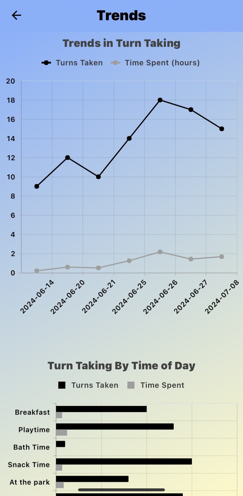

# Treatment Engagement Parent App

## Example Screens

    
    
    
    
    
    

## Instructions for Phone Setup
1. Visit https://track-it-app-b875b.web.app/ from your mobile browser (i.e. Chrome, Safari, etc.)
2. Tap on the share website icon
3. Choose 'Add to Home Screen' (Optionally rename the shortcut)
4. Sign up via email and wait for an authentication link
   1. If link is not sent please reach out
5. After successful sign up and log in, the app is ready for logging data, and you will be connected with your expected contacts shortly

## General App Notes
- 'Trends' will not function properly until a sufficient amount of data has been logged
- Parents do not have the ability to create new contacts
  - If you are not a parent and do not have access, please reach out
- 'ASE Strategies' will be consistently updated according to current research
- 'Goals' and 'ASE Manual' have note yet been implemented as of September 2024

## Bug Tracking and To Do (Sept. 2024)

#### Times of Day

- No known issues

#### Trends

- Axis label disappearance solved 09/04/2024

#### ASE Strategies

- No known issues

#### ASE Manual

- Not implemented

#### Goals

- Not implemented

#### Contact Us

- No known issues
- Order by most recent message
- Add notification of message
- Mark providers (i.e. Primary Therapist, Secondary, etc.)

## Exporting Data

From this repository, in your terminal/command prompt run:

`python export.py \path\to\credentials.json {collection_name}`